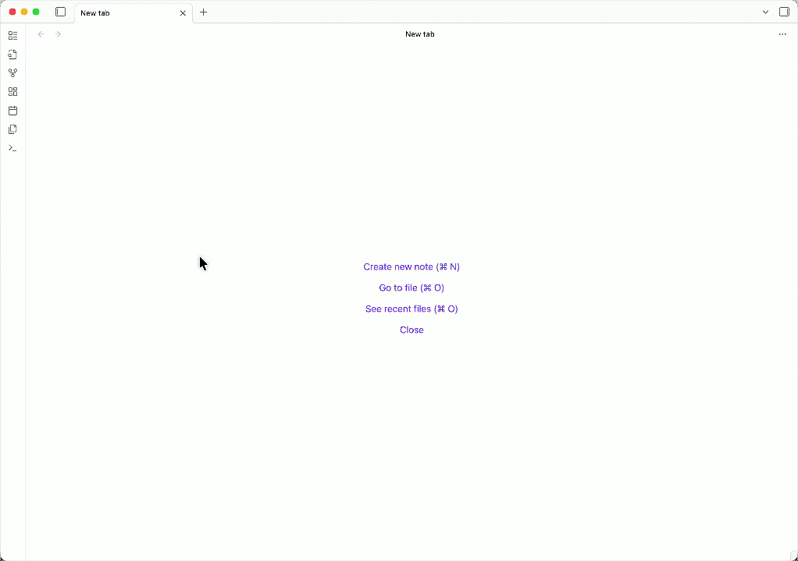

# Claude AI for Obsidian

CAO allows you to chat with Claude directly in a note. You can either use Claude models with its official support, or leverage on OpenAI-compatible APIs(OpenAI, OpenRouter etc) for non-Claude models, such as ChatGPT.


Instead of default format with headers, another option is to switch for callouts, which are foldable and provide more obvious differences between questions and answers.


You may also find it useful to create your own prompts to quickly insert them with templates and specified position for the cursor.



## Features

1. [x] Chat in notes with **editable** content
2. [x] Manage chat histories as plain notes
3. [x] Customize chat options in **front matter**
4. [x] Support **wikilinks** for adding notes as context
5. [x] Support custom API providers such as OpenRouter
6. [x] Support custom prompts with templates
7. [x] Support **callouts** for chat formatting
8. [ ] Support image embedding in prompts

## Installation

Search for CAO in Obsidian's community plugins page.

## Usage

- Set up API providers
  - You can choose to use official Anthropic APIs or OpenAI-compatible API providers such as OpenRouter
  - For official Anthropic APIs, enter your API key and select a model from the dropdown menu
  - For custom API providers, you need to also set the base URL(it defaults to `https://api.openai.com/v1` for OpenAI models)
    - In this case, you need to manually enter the model name of which the format may vary depending on the provider
- Config chat options
  - You can designate a custom folder for chat histories
  - You can also update max tokens, temperature and system prompt to suit your needs
  - Toggle streaming response open for better performance and showing stats allows you to see token usage for each response
- Try available commands
  - Use `Open new chat` command to create a new chat note
  - Optionally, there's `Add/Reset chat options` for customization
  - For replies, fire up `Get response`(you may want a hot key for this, such as **Cmd/Ctrl + .**)
  - Next time, use `Open last chat` to resume last conversation or `Select chat` to select a history chat

Here're the available chat options with example values to set in the front matter:

```
---
model: claude-sonnet-4-5
max_tokens: 1024
temperature: 1
system_prompt: You are a helpful AI assistant
---
```

### Custom API providers

CAO supports OpenAI-compatible API providers. Here's an example for OpenRouter:

- Base URL: `https://openrouter.ai/api/v1`
- Model format: `anthropic/claude-sonnet-4.5` or `openai/gpt-4o`
- Get your API key from [OpenRouter](https://openrouter.ai)

Notes:

- Using Claude models with custom API providers may have [limitations](https://docs.claude.com/en/api/openai-sdk#important-openai-compatibility-limitations).
- It's possible to use non-Claude models now, but be aware it is experimental and not fully tested.

### Custom prompts

Now you can add custom prompts in settings, which will become available in the command palette or as slash commands(if toggled on in core plugins).

Additionally, you can use `{cursor}` in the prompt template as a placeholder of cursor for editing after the prompt is inserted.

### Use callouts for chat formatting

You can choose to use callouts instead of headers to format chat messages, for now this is turned off by default.

For consistency, callouts and headers are not allowed to coexist in the same chat, so if you're already using headers in a chat, you have to clear it or open a new chat to use callouts.

## Supported Models

CAO supports all Claude models, take a look at [here](https://platform.claude.com/docs/en/about-claude/models/overview) for more details.

**You can either choose an active model in the dropdown menu, or specify an old one in the front matter as illustrated above.**

## Contributing

For bug fixes or feature improvements, please create an issue or pull request.

For ideas or any other questions, please post in discussion.

Any suggestions or support is welcome and appreciated, thank you!
